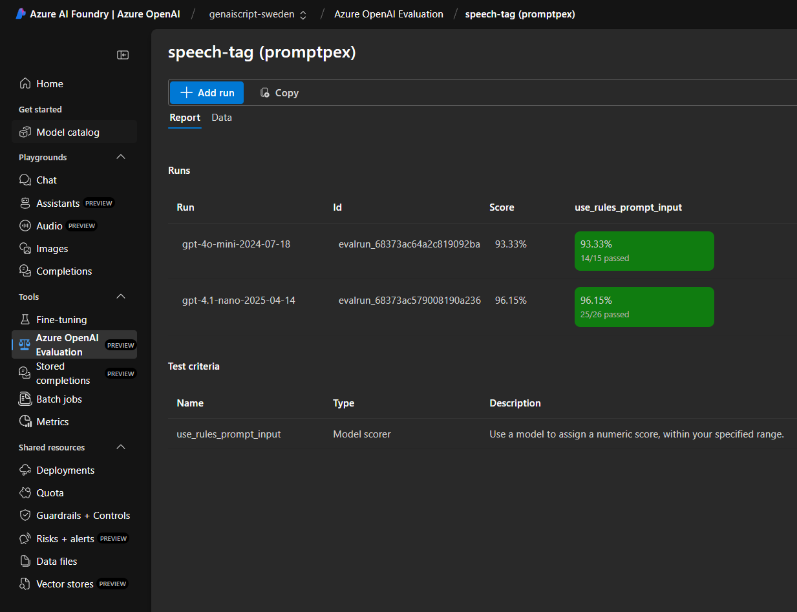

PromptPex support exporting the generated tests into a [Azure OpenAI Evaluations](https://learn.microsoft.com/en-us/azure/ai-services/openai/how-to/evaluations?tabs=question-eval-input).
PromptPex will generate an **eval** and launch an **eval run** for each Model Under Test (MUT) in the test generation.

## Configuration

PromptPex uses the Azure OpenAI credentials configured either in environment variables
or through the Azure CLI / Azure Developer CLI. See [GenAIScript Azure OpenAI Configuration](https://microsoft.github.io/genaiscript/configuration/azure-openai/).

The Azure OpenAI models that can be used as **Model Under Test** are the deployments available in your Azure OpenAI service.
