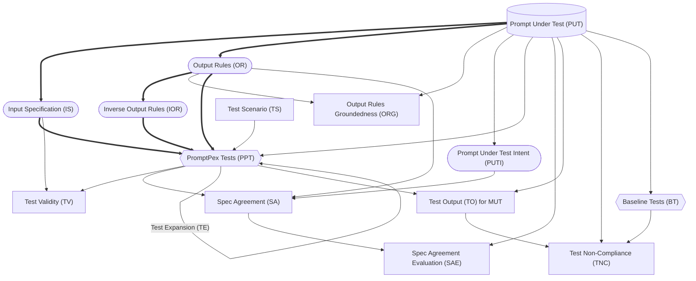

- **Prompt Under Test (PUT)** - like Program Under Test; the prompt
- **Model Under Test (MUT)** - Model which we are testing against with specific temperature, etc example: gpt-4o-mini
- Model Used by PromptPex (MPP) - gpt-4o

- Input Specification (IS) - Extracting input constraints of PUT using MPP (input_spec)
- Output Rules (OR) - Extracting output constraints of PUT using MPP (rules_global)
- Inverse Output Rules (IOR) - Inverse of the generated Output Rules
- Output Rules Groundedness (ORG) - Checks if OR is grounded in PUT using MPP (check_rule_grounded). See [Ground Truth and Groundedness Evaluation](/promptpex/reference/ground-truth/)

- Prompt Under Test Intent (PUTI) - Extracting the exact task from PUT using MMP (extract_intent)

- Test Scenario (TS) - Set of additional input constraint variations not captured in the prompt.

- PromptPex Tests (PPT) - Test cases generated for PUT with MPP using IS and OR (test)
- Baseline Tests (BT) - Zero shot test cases generated for PUT with MPP (baseline_test)

- Test Expansion (TE) - Expanding the test cases from examples and generally telling the LLM to make them more complex (test_expansion)

- Test Validity (TV) - Checking if PPT and BT meets the constraints in IS using MPP (check_violation_with_input_spec)
- Spec Agreement (SA) - Result generated for PPT and BT on PUTI + OR with MPP (evaluate_test_coverage)

- Test Output (TO) - Result generated for PPT and BT on PUT with each MUT (the template is PUT)
- Test Non-Compliance (TNC) - Checking if TO meets the constraints in PUT using MPP (check_violation_with_system_prompt)

 

- Every node is created by a LLM call (aside from the PUT).
- Rounded nodes can be edited by the user.
- Square nodes are evaluations.
- Diamond nodes are outputs.
- Lines represent data dependencies.
- Bolded lines are the minimum path to generate tests.
