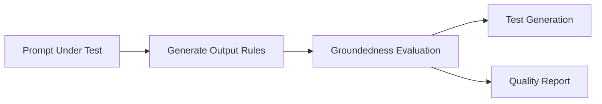

# Ground Truth and Groundedness Evaluation

PromptPex includes a **groundedness evaluation** feature that validates whether generated output rules are actually supported by (grounded in) the original prompt description. This is a critical quality assurance step that ensures the testing process doesn't create artificial requirements that aren't present in the original prompt.

## What is Groundedness?

In the context of PromptPex, groundedness refers to whether an **output rule** can be traced back to and supported by the information explicitly provided in the **Prompt Under Test (PUT)**. 

A rule is considered:
- ✅ **Grounded**: The rule is clearly supported by information in the prompt description
- ❌ **Not Grounded**: The rule introduces requirements not present in the original prompt

## Why Groundedness Matters

Groundedness evaluation prevents several common issues in automated prompt testing:

1. **Hallucinated Requirements**: Rules that introduce constraints not mentioned in the original prompt
2. **Over-specification**: Rules that are too restrictive based on the prompt's actual requirements  
3. **Testing Drift**: Ensuring tests validate what the prompt actually asks for, not what the testing system imagines

## How Groundedness Evaluation Works

The groundedness evaluation process follows these steps:

1. **Rule Generation**: PromptPex generates output rules from the Prompt Under Test
2. **Groundedness Check**: Each rule is individually evaluated against the original prompt description
3. **Binary Decision**: Each rule receives either "OK" (grounded) or "ERR" (not grounded)
4. **Quality Assessment**: The overall groundedness score indicates rule quality

### Technical Implementation

The groundedness evaluation uses the `eval_rule_grounded.prompty` template with the following process:

```
Input: Rule + Original Prompt Description
Output: OK or ERR
```

The evaluation model is prompted to:
- Compare the specific rule against the prompt description
- Determine if the rule is supported by explicit information in the description
- Provide a binary decision (OK/ERR) without additional explanation

## Example Groundedness Evaluation

### Scenario: Customer Support Chatbot

**Original Prompt Description:**
```
You are a helpful customer support assistant. Respond to customer inquiries 
about billing, account issues, and general questions. Keep responses concise 
and professional.
```

**Generated Output Rules:**

| Rule | Grounded? | Explanation |
|------|-----------|-------------|
| "Response must be professional in tone" | ✅ OK | Explicitly mentioned in prompt |
| "Response must be concise" | ✅ OK | Explicitly mentioned in prompt |
| "Must only answer billing and account questions" | ❌ ERR | Prompt also mentions "general questions" |
| "Must include customer's name in response" | ❌ ERR | Not mentioned anywhere in prompt |

## Understanding Groundedness Results

### Individual Rule Results

Each rule evaluation returns:
- **Rule Text**: The specific rule being evaluated
- **Grounded Status**: `OK` or `ERR`
- **Grounded Text**: The model's reasoning (for debugging)

### Aggregate Metrics

PromptPex provides summary statistics:
- **Total Rules**: Number of rules evaluated
- **Grounded Rules**: Count of rules marked as "OK"
- **Groundedness Rate**: Percentage of rules that are grounded
- **Quality Score**: Overall assessment of rule quality

## Best Practices

### Improving Groundedness Scores

1. **Clear Prompt Descriptions**: Write detailed, explicit prompt descriptions
2. **Avoid Ambiguity**: Be specific about requirements and constraints
3. **Review Low Scores**: Investigate rules marked as "ERR" to understand gaps
4. **Iterative Refinement**: Update prompts based on groundedness feedback

### Interpreting Results

- **High Groundedness (>90%)**: Rules closely match prompt requirements
- **Medium Groundedness (70-90%)**: Some rule drift, review recommended  
- **Low Groundedness (<70%)**: Significant issues with rule generation

## Integration with PromptPex Workflow

Groundedness evaluation is automatically included in the PromptPex testing pipeline:



The groundedness results influence:
- **Test Quality**: Better grounded rules produce more accurate tests
- **Rule Filtering**: Non-grounded rules can be flagged or excluded
- **Prompt Refinement**: Low groundedness indicates prompt clarity issues

## Command Line Usage

Groundedness evaluation is enabled by default in PromptPex runs. Results appear in:

- **Console Output**: Summary statistics during execution
- **JSON Reports**: Detailed groundedness data in output files
- **HTML Reports**: Visual groundedness metrics in web interface

## Related Concepts

- **[Output Rules (OR)](/promptpex/reference/glossary#output-rules)**: The rules being evaluated for groundedness
- **[Test Evaluation](/promptpex/reference/test-evaluation/)**: How groundedness fits into overall testing
- **[Prompt Under Test (PUT)](/promptpex/reference/glossary#prompt-under-test)**: The source of truth for groundedness evaluation

## Troubleshooting

### Common Issues

**Low Groundedness Scores**
- Check if prompt description is sufficiently detailed
- Review generated rules for over-specification
- Consider if the prompt needs clearer constraint statements

**Inconsistent Results**
- Ensure prompt description covers all important requirements
- Verify that rules are generated from the correct prompt version
- Check for ambiguous language in the prompt description

**All Rules Marked as ERR**
- Verify prompt format and structure
- Check that prompt description section is properly formatted
- Ensure rule generation is working correctly