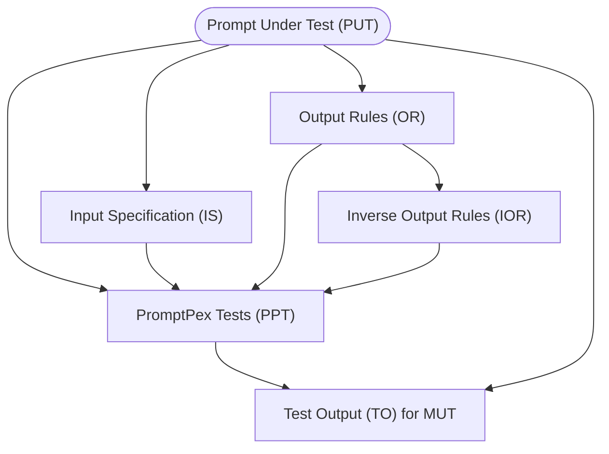

PromptPex is a test generator for LLM prompts.
From a templated prompt, it generates a set of test cases and a compliance evaluation metric.

## Prompts are Programs

**Prompts** are an important part of any software project that incorporates
the power of AI models. As a result, tools to help developers create and maintain
effective prompts are increasingly important.

- [Prompts Are Programs - ACM Blog Post](https://blog.sigplan.org/2024/10/22/prompts-are-programs/)

**PromptPex** is a tool for exploring and testing AI model prompts. PromptPex is
intended to be used by developers who have prompts as part of their code base.
PromptPex treats a prompt as a function and automatically generates test inputs
to the function to support unit testing.

- [PromptPex technical paper](http://arxiv.org/abs/2503.05070)

## How test generation works

The test generation process is a workflow of LLM invocation that process the prompt template into a test suite.

The essential concepts are:

- **Prompt Under Test (PUT)**: The prompt under test is the prompt that is being tested. It is a function that takes an input and produces an output.
- **Input Specification (IS)**: The input specification describes the input to the prompt. It is a set of constraints on the input that are used to generate test cases.
- **Output Rules (OR)**: The output rules describe the expected output of the prompt. It is a set of constraints on the output that are used to generate test cases.
- **Inverse Output Rules (IOR)**: The inverse output rules is the inverse of the output rules. It is used
  to generate diverse test cases that stress test the robustness of the prompt.

The input specification, output rules and prompts is then used to generate a set of test cases using various LLM calls.

