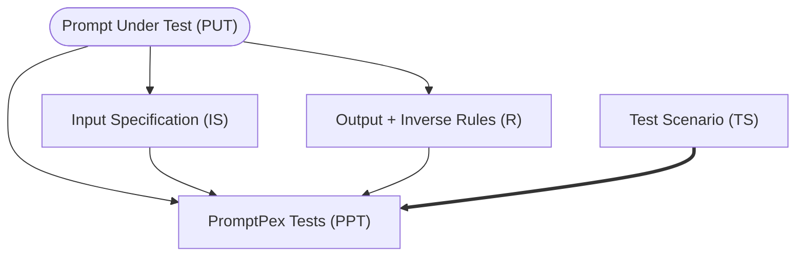

PromptPex supports specify a set of additional input constraints (scenario)
to generate specific test suites. A canonical example would be
localization testing: `generate English, generate French`.



PromptPex enumerates through the scenarios and the rules and generates a test for each combination.

```py
for each scenario in scenarios:
  for each rule in rules:
    generate test for scenario, rule
```

## Configuration

The test generation scenarios are configured in the prompt front-matter. You can decide to fill in any of the 
template variables in each scenario.

```yaml wrap
scenarios:
    - name: English
      instructions: The user speaks and writes in English.
    - name: French
      instructions: The user speaks and writes in French.
      parameters:
          locale: fr-FR
```
