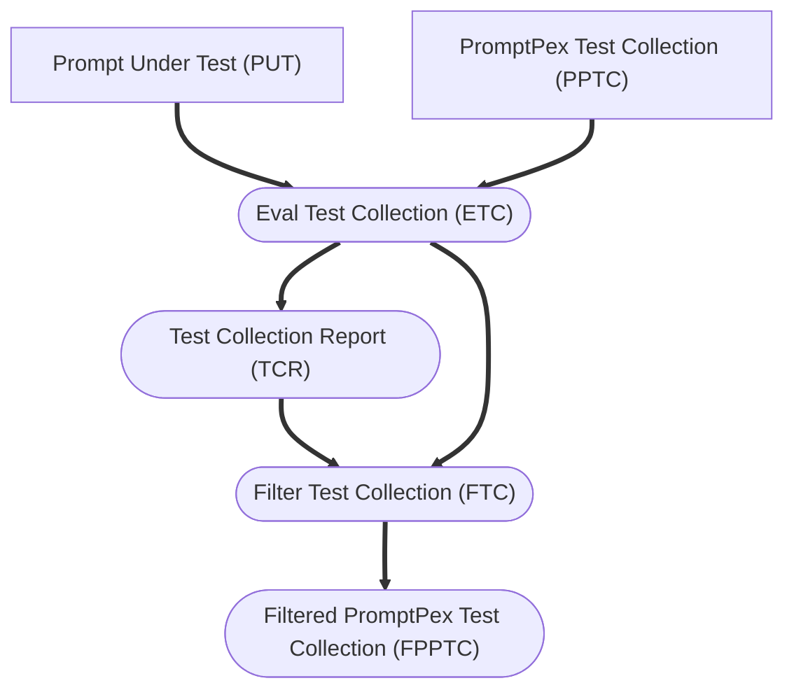

Given a set of generated tests (PPT), a user might be interested in understanding properties about the entire collection.  For example, do the tests cover all the possible inputs to the prompt, are some tests redundant, or are some tests more important than others? 

PromptPex provides a way to analyze the tests and prioritize them based on different criteria.  Using the `rateTests` flag, PromptPex will generate a **Test Collection Report** (`test_collection_review.md`) that reviews the collection of tests, describes the properties of the collection, and rates each test based on their importance.  This report is human readable and can be used to understand the collection of tests.  

In addition, this report can be input when the `filterTestCount` parameter is given.   When `filterTestCount` is greater than zero, PromptPex will filter the tests based on the report and generate a **Filtered PromptPex Test Collection** (FPPTC) that contains the number of tests specificed by the parameter value in the file `filtered_tests.json`.  This allows the user to focus on the most important tests and ignore the less important ones.

