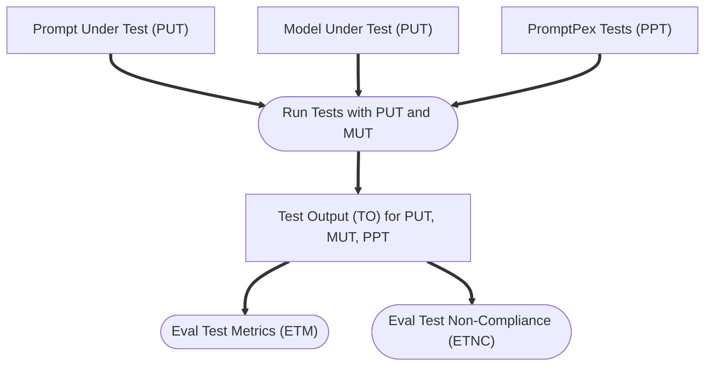

Given a set of generated tests (PPT), the next step is to **evaluate** the **Prompt Under Test (PUT)** and a particular **Model Under Test (MUT)** against those tests.



### Model Under Test

Test results will depend on both the PUT and the MUT. PromptPex allows the user to specify any number of MUTs to allow the user to understand how their prompt performs across different models. Running the tests for a given PUT and MUT will produce a set of outputs for each test. This output can then be evaluated using different metrics to understand how well the prompt performs.

### Evaluation Metrics

PromptPex supports different metrics to evaluate the performance of the PUT, MUT, and tests. PromptPex has a built-in metric, **Test for Non-Compliance** (TNC), which checks if the output of the prompt meets the constraints specified in the PUT. This is done by checking the output against the input specification and output rules of the PUT.

PromptPex also supports user-defined metrics. These metrics are defined in a prompty file with a naming convention `METRIC_NAME.metric.prompty`. Any files following this naming convention and located in the same directory as the PUT will be automatically detected and used as metrics.

The prompty file that defines the metric should contain a `system` section that describes the metric and how it should be evaluated. The available input parameters to the metric are:

- **output**: The output of the prompt under test.
- **prompt**: The prompt under test.
- **rules**: The rules that the output must comply with.
- **input**: The input to the prompt under test.

Here is an example of a user-defined metric that uses the rules to determine if the output complies with the rules:

```markdown wrap title="use_rules.metric.prompty"
system:
Your task is to very carefully and thoroughly evaluate the given output generated by a chatbot in <CHATBOT_OUTPUT> to find out if it comply with all the rules provided to you in <RULES>.

Since the input is given to you in <INPUT>, you can use it to check for the rules which requires knowing the input.

### Here are the guidelines to follow for your evaluation process:

1. **Direct Compliance Only**: Your evaluation should be based solely on direct and explicit compliance with the rules provided. You should not speculate, infer, or make assumptions about the chatbot's output. Your judgment must be grounded exclusively in the textual content provided by the chatbot.

2. **Decision as Compliance Score**: You are required to generate a compliance score based on your evaluation:

    - Return 100 if <CHATBOT_OUTPUT> complies with all the rules
    - Return 0 if it does not comply with any of the rules.
    - Return a score between 0 and 100 if <CHATBOT_OUTPUT> partially complies with the rules
    - In the case of partial compliance, you should based on the importance of the rules and the severity of the violations, assign a score between 0 and 100. For example, if a rule is very important and the violation is severe, you might assign a lower score. Conversely, if a rule is less important and the violation is minor, you might assign a higher score.

3. **Compliance Statement**: Carefully examine the output and determine why the output does not comply with the rules, think of reasons why the output complies or does not compiles with the rules, citing specific elements of the output.

4. **Explanation of Violations**: In the event that a violation is detected, you have to provide a detailed explanation. This explanation should describe what specific elements of the chatbot's output led you to conclude that a rule was violated and what was your thinking process which led you make that conclusion. Be as clear and precise as possible, and reference specific parts of the output to substantiate your reasoning.

5. **Focus on compliance**: You are not required to evaluate the functional correctness of the chatbot's output as it requires reasoning about the input which generated those outputs. Your evaluation should focus on whether the output complies with the rules, if it requires knowing the input, use the input given to you.

6. **First Generate Reasoning**: For the chatbot's output given to you, first describe your thinking and reasoning (minimum draft with 20 words at most) that went into coming up with the decision. Answer in English.

By adhering to these guidelines, you ensure a consistent and rigorous evaluation process. Be very rational and do not make up information. Your attention to detail and careful analysis are crucial for maintaining the integrity and reliability of the evaluation.

<RULES> 
{{rules}}
</RULES>

user:
<CHATBOT_OUTPUT>
{{output}}
</CHATBOT_OUTPUT>
```

## OpenAI and Azure OpenAI Evaluations

PromptPex can automatically create an evaluation run with the generated tests and the metrics in [OpenAI Evals](/promptpex/integrations/openai-evals)
or [Azure OpenAI Evaluations](/promptpex/integrations/azure-openai-evals).
