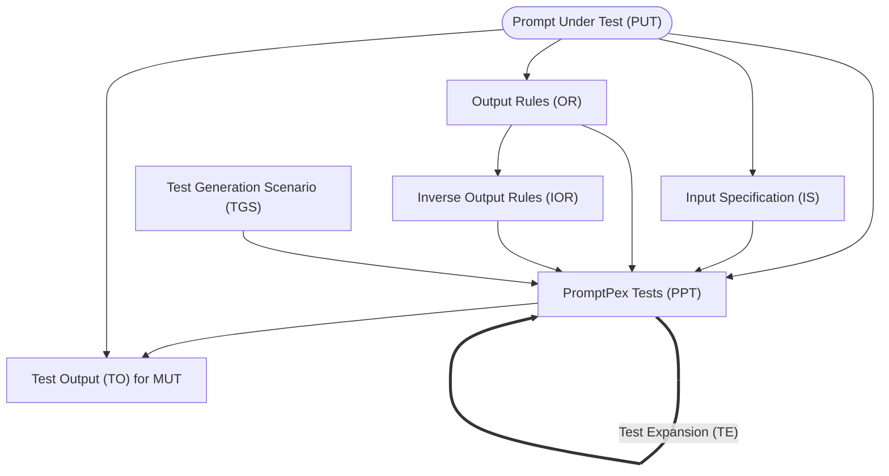

## Test Expansion

Test expansion is a way to generate more complex tests from the initial test cases. It uses the same LLM as the one used for the prompt under test.

```mermaid
graph TD
    PUT(["Prompt Under Test (PUT)"])
    IS["Input Specification (IS)"]
    OR["Output Rules (OR)"]
    IOR["Inverse Output Rules (IOR)"]
    PPT["PromptPex Tests (PPT)"]
    TO["Test Output (TO) for MUT"]
    TGS["Test Generation Scenario (TGS)"]

    PUT --> IS

    PUT --> OR
    OR --> IOR

    PUT --> PPT
    IS --> PPT
    OR --> PPT
    IOR --> PPT

    PPT ==>|"Test Expansion (TE)"| PPT

    TGS --> PPT

    PPT --> TO
    PUT --> TO
```
