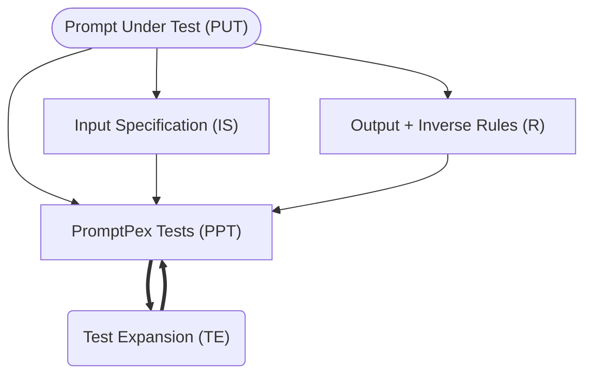

Test expansion uses a [LLM prompt](https://github.com/microsoft/promptpex/blob/dev/src/prompts/expand_test.prompty) to _expand_ a test and make it more complex. It can be applied repeatedly to generate a set of tests with different levels of complexity.



For example,

```text wrap
The quick fox leaped over 10 fences.
```

becomes

```text wrap
In a quiet meadow, the quick brown fox daringly leaped over a total of ten tall, wooden fences, amazing the onlooking wildlife with its agility and grace.
```

## Configuration

The number of test expansions can be configured in the prompt frontmatter or via command line parameters.

- `testExpansions`: The number of test expansions to generate. This is a positive integer. The default value is `1`.
- to disable test expansion, set `testExpansions` to `0`.

```md wrap
---
testExpansions: 0
---
```

- to expand twice, set `testExpansions` to `2`.

```md wrap
---
testExpansions: 2
---
```
