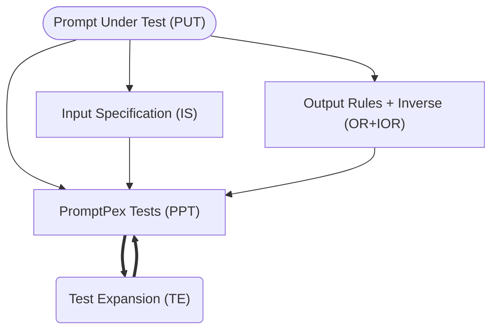

import { Code } from '@astrojs/starlight/components';
import promptSrc from "../../../../../src/prompts/expand_test.prompty?raw";

Test expansion uses a LLM call to _expand_ a test and make it more complex. It can be applied repeatedly to generate a set of tests with different levels of complexity.



For example,

```txt
The quick fox leaped over 10 fences.
```

becomes

```txt
In a quiet meadow, the quick brown fox daringly leaped over a total of ten tall, wooden fences, amazing the onlooking wildlife with its agility and grace.
```

## Frontmatter Parameters

- `testExpansions`: The number of test expansions to generate. This is a positive integer. The default value is `1`.

- to disable test expansion, set `testExpansions` to `0`.

```md wrap
---
testExpansions: 0
---
```

- to expand twice, set `testExpansions` to `2`.

```md wrap
---
testExpansions: 2
---
```

## LLM Template

The [expand_test](https://github.com/microsoft/promptpex/blob/main/src/prompts/expand_test.prompty)
template implements the test expansion.

<Code code={promptSrc} wrap title="src/prompts/expand_test.prompty" lang="md" />