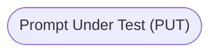
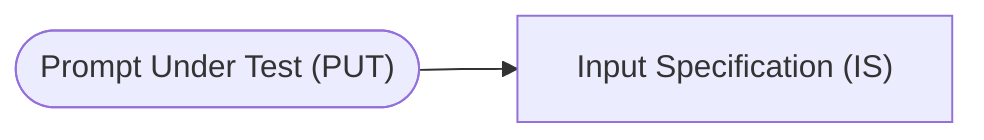
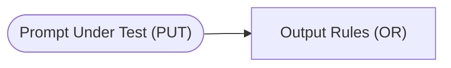
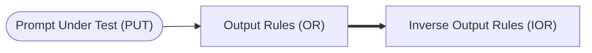
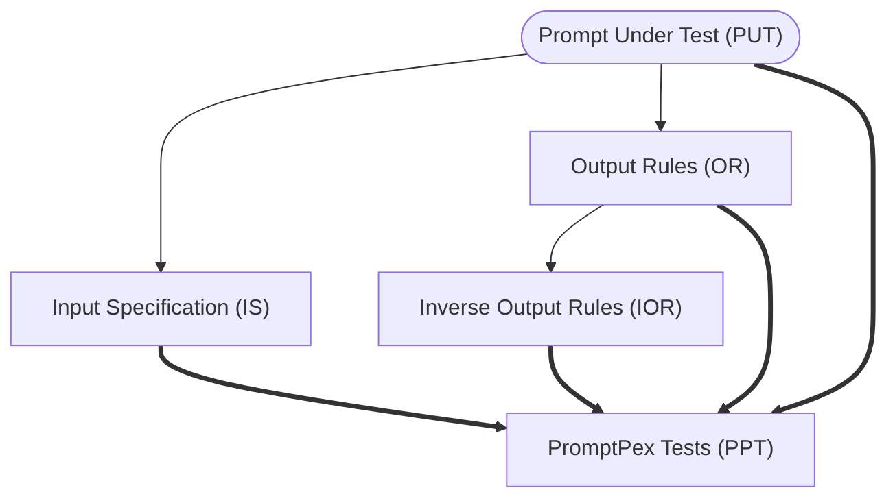

The heart of the test generation process is a series of transformations that take a prompt under test and generate a set of tests. 

- [PromptPex technical paper](http://arxiv.org/abs/2503.05070)

## Example prompt

Let's look at a prompt that is designed to identify the part of speech of a word in a sentence ([full version](https://github.com/microsoft/promptpex/blob/main/samples/speech-tag/speech-tag.prompty)). The prompt is referenced as the **Prompt Under Test (PUT)**. 




```markdown wrap
In this task, you will be presented with a sentence and a word contained in that sentence. You have to determine the part of speech
for a given word and return just the tag for the word's part of speech. Return only the part of speech tag.
If the word cannot be tagged with the listed tags, return Unknown. If you are unable to tag the word, return CantAnswer.
```

## Input Specification

The [first transformation](https://github.com/microsoft/promptpex/blob/dev/src/prompts/generate_intent.prompty) takes the prompt uder test and extracts the **input specification (IS)**. 
The input specification is a description of the input to the prompt. 
In this case, the input consists of a sentence and a word from that sentence.



```text wrap title="Input Specification"
The input consists of a sentence combined with a specific word from that sentence.
The sentence must contain natural language text.
The word must be a single word from the provided sentence.
```

## Output Rules

The [second transformation](https://github.com/microsoft/promptpex/blob/dev/src/prompts/generate_output_rules.prompty) takes the prompt under test and extracts the **output rules (OR)**.
The output rules are a description of the output of the prompt.
In this case, the output consists of a part of speech tag for the word.



```text wrap title="Output Rules"
The output must return only the part of speech tag without any additional text or formatting.
If the given word can be identified with one of the listed part of speech tags, the output must include only the specific tag for that word from the provided alphabetical list.
If the given word cannot be tagged with any of the listed part of speech tags, the output should be the word "Unknown".
If tagging the given word is not possible for any reason, the output should be the word "CantAnswer".
```

## Inverse Output Rules

The [third transformation](https://github.com/microsoft/promptpex/blob/dev/src/prompts/generate_inverse_rules.prompty) takes the output rules and generates the **inverse output rules (IOR)**.
The inverse output rules are a description of the output of the prompt that is the opposite of the output rules.
In this case, the inverse output rules are a description of the output of the prompt that is the opposite of the output rules.



```text wrap title="Inverse Output Rules"
The output must not return any additional text or formatting.
The output must not include any of the listed part of speech tags.
The output must not include the word "Unknown".
The output must not include the word "CantAnswer".
```

## Tests generated from the rules:

From the input specification, output rules, inverse output rules, PromptPex uses a [LLM prompt](https://github.com/microsoft/promptpex/blob/dev/src/prompts/generate_tests.prompty) to generate a set of tests.


```text wrap
sentence: 'An aura of mystery surrounded them.', word: 'aura'
sentence: 'The researchers documented carefully.', word: 'carefully'
# Note this tests the Unknown corner case
sentence: 'This is such a unique perspective.', word: 'such'
```

## Try it out!

We provide a local web interface to try out the test generation process.
It requires to configure your LLM credentials in `.env` file.


- Install [Node.js v20+](https://nodejs.org/)
- Configure your LLM credentials in `.env`. You can use OpenAI, Azure OpenAI, or Ollama.

```sh
npx --yes genaiscript configure
```

- Launch promptpex remotely

```sh
npx --yes genaiscript serve --remote microsoft/promptpex --remoteBranch dev
```

:::tip

Want to use Python? Checkout the [Python implementation](/promptpex/dev/python/).

:::
