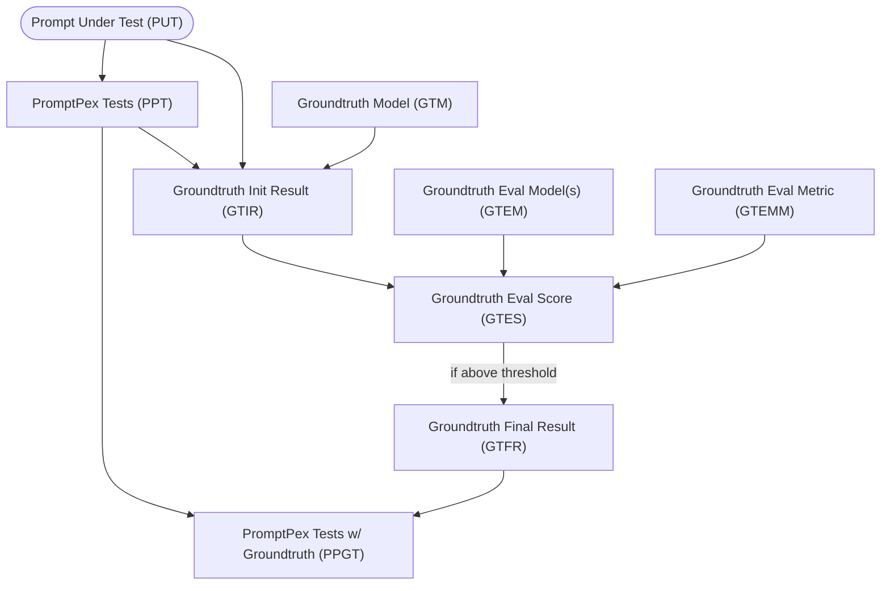

Ideally, every test should have a correct value for the expected output.  Because PromptPex generates tests using AI, the correct value is not always known.  As a result, PromptPex provides a way to generate expected outputs for tests, which we call **groundtruth**, also using an AI model.  The diagram below shows the flow of how PromptPex generates groundtruth for tests.



The first step in the process of generating groundtruth is to create a **PromptPex Test (PPT)** from the **Prompt Under Test (PUT)**.  The **Groundtruth Model (GTM)** should be the best model available because we will assume that it is the most accurate model for generating the expected output. The GTM is called with each test in PUT and the output from that model **GITR** is considered a candidate for the expected output.  To ensure that this output is accurate, we use a list of models, referred to as **Groundtruth Eval Model(s) (GTEM)**, to evaluate the output from the GTM.  Each model in the GTEM is used to generate a score for the output from the GTM.  Each of the GTEM runs a single metric on the output from the GTM, and generates a score which are then combined together (by averaging) into the **Groundtruth Eval Score (GTES)**.   If this score is above a certain threshold, then the output from the GTM is considered valid and is used as the expected output for the test.  This final result is referred to as the **Groundtruth Final Result (GTFR)**, which is then added to the tests to create the **PromptPex Tests w/ Groundtruth (PPGT)**.  The PPGT can then be used for further evaluation or testing.

When the groundtruth is generated, 3 new fields are added to each test:

- `groundtruth`: The expected output from the groundtruth model.
- `groundtruthModel`: The model used to generate the groundtruth output.
- `groundtruthScore`: The combined evaluation score from the groundtruth evaluation model(s). If the score is -1, then the combined evaluation score was below the threshold after several retries, and the groundtruth should not be considered valid.


## Configuring Groundtruth

More details about all the parameters you can specify can be found in the [CLI parameter documentation](/promptpex/cli/parameters).

To generate groundtruth outputs for tests, you can specify the `groundtruthModel` parameter to indicate which model to use for generating the expected outputs.  You can also specify the `evalModelGroundtruth` parameter to indicate which model(s) to use for evaluating the output from the groundtruth model.  The `evalModelGroundtruth` can be a single model or a list of models separated by semicolons.  

By default, the [metric file](https://github.com/microsoft/promptpex/blob/dev/src/prompts/groundtruth-eval.metric.prompty) in `promptpex/src/prompts/groundtruth-eval.metric.prompty` is used to evaluate the output from the groundtruth model.  If you want a metric to be used for groundtruth metric evaluation, set the `groundtruth` tag in the `.metric.prompty` file.

This is an example of how to generate groundtruth outputs for tests using the `groundtruthModel` and `evalModelGroundtruth` parameters:

```sh wrap
npx promptpex my_prompt.prompty --vars effort=min out=results --vars groundtruthModel="azure:gpt-4.1-mini_2025-04-14" --vars evalModelGroundtruth="azure:gpt-4.1-mini_2025-04-14;ollama:llama3.3"
```

