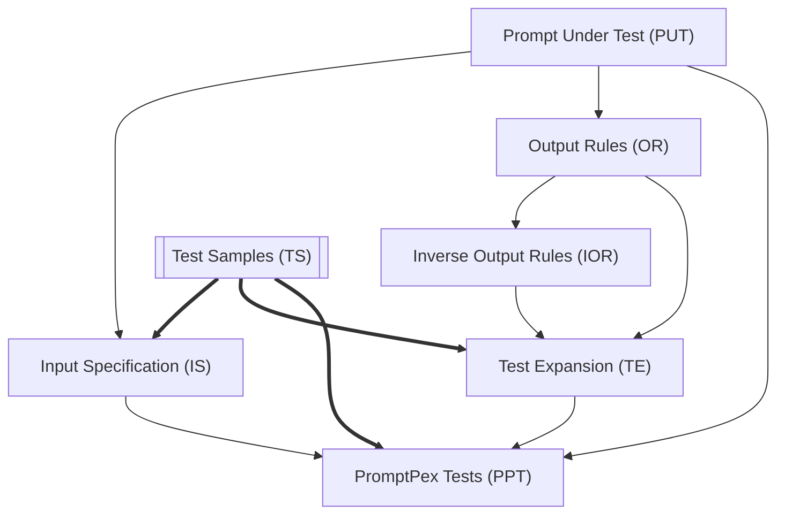

import { LinkCard } from "@astrojs/starlight/components"

It is possible to define test samples in the `testSamples` section of the YAML file. This section allows you to specify a list of test cases and expected output. 
The test samples are used in the test generation process to generate tests that mimic actual user input.




## Configuration

You can specify `testSamples` in the prompt frontmatter as an array of objects.

```yaml wrap
testSamples:
    - locale: "en-us"
      joke: "Why did the scarecrow win an award? Because he was outstanding in his field."
      output: "funny"
    - locale: "fr-FR"
      joke: "Pourquoi les plongeurs plongent-ils toujours en arrière et jamais en avant? Parce que sinon ils tombent dans le bateau."
      output: "funny"
```

## Parameters

When invoking promptex, you can also provide filters to limit the number of test samples used
in the generation:

- `testSamplesCount`: The number of test samples to use in the generation. This is useful to limit the amount of test samples used in the generation.
- `testSamplesShuffle`: Whether to shuffle the test samples before using them in the generation. This is useful to ensure that the test samples are not used in the same order every time.

<LinkCard  title="Custom Instructions" href="/promptpex/reference/custom-instructions" />
