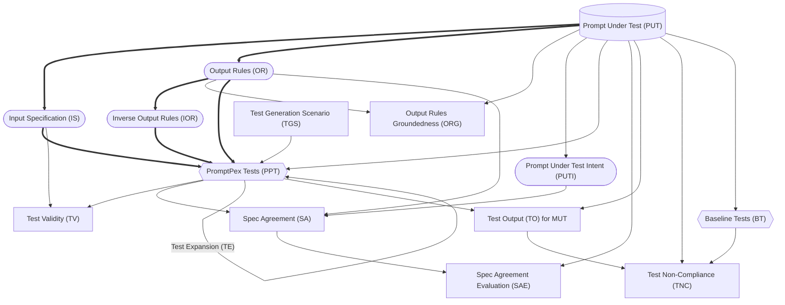

The diagram below shows the flow of test generation in PromptPex, starting from the PUT (database shape).

 

- Every node is created by a LLM call (aside from the PUT).
- Rounded nodes can be edited by the user.
- Square nodes are evaluations.
- Diamond nodes are outputs.
- Lines represent data dependencies.
- Bolded lines are the minimum path to generate tests.
